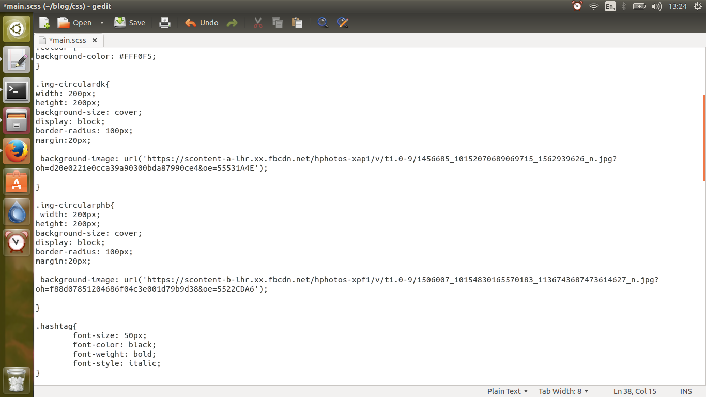
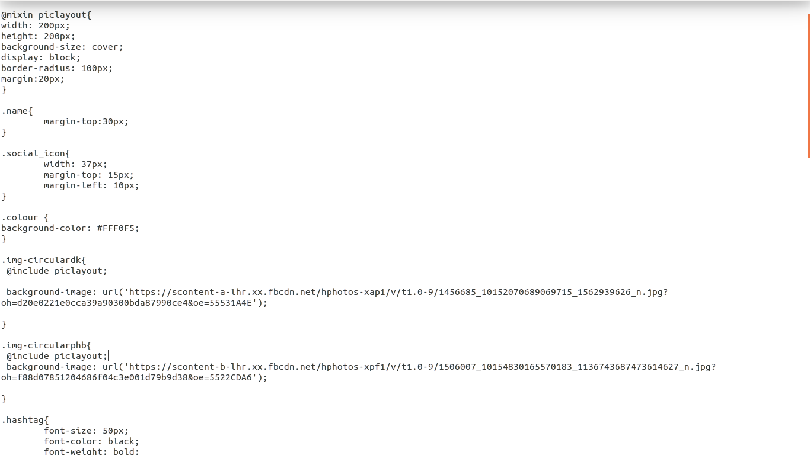

# SCSS

SCSS stands for Sassy Cascading Style Sheets.

You can use it to condense your CSS.

One of the advantages of SASS is the ability to write programmatic CSS.

* You can set resuable CSS variables:

```
$font-stack:    Helvetica, sans-serif;
$primary-color: #333;

body {
  font: 100% $font-stack;
  color: $primary-color;
}
```

* You can perform mathematical operations:

```
.container
  width: 100%

article[role="main"]
  float: left
  width: 600px / 960px * 100%

aside[role="complimentary"]
  float: right
  width: 300px / 960px * 100%
```
compiles to:

```
.container {
  width: 100%;
}

article[role="main"] {
  float: left;
  width: 62.5%;
}

aside[role="complimentary"] {
  float: right;
  width: 31.25%;
}
```




You can see that the classes 'img-circulardk' and 'img-circularphb' have the same CSS styling except for their background images. With SCSS you can effectively create a CSS template to use in multiple classes.




Using @mixin, You can define the CSS that you'd like to template. The Syntax is @mixin name { }.
Whenever you want a class to have this template CSS. You put '@include name' where you would normally put your styling.